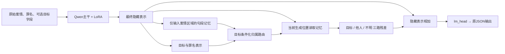

# 模型模块路线：2025—2026文献核查与H5实验设计

日期：2026-09-27设计，2026-09-28实现交付。状态：**文献与架构设计已完成第一轮；最小Transformers模块及GPU 1实验入口已实现，149项离线检查通过；真实训练与vLLM适配尚未验证/实现。** 用户已要求直接实现并利用空闲A100并行运行，见[用户服务器命令](RUN_TERA.md)。本文是RESEARCH_PLAN.md的设计附件，不替代科研主记录。

## 1. 本轮决定与边界

按用户要求，后续主贡献优先落在模型内部的可训练模块。正在服务器运行的Qwen2.5原生EOS版本direct/flat/bound实验继续完成，作为监督形式对照及后续基线；不改其代码、超参、数据或输出，不中途切换实验。用户报告任务正在运行，助手未直接读取服务器状态。

首选原型：**目标人物条件化证据路由适配器（Target-conditioned Evidence Routing Adapter，暂称TERA）**。模块从本案输入隐藏表示构造证据记忆，学习区分与目标人物相关、其他人物、归属不明的信息，通过残差通路改变下一个token的隐藏表示。它不需要推理时调用教师，也不增加一段必须生成的证据JSON。

候选贡献H5：在相同可见案情、目标字段、数据和输出目标下，显式的目标条件化路由能否比同等参数量、同等辅助监督的普通记忆适配器更少发生主体误归，并改善刑期MAE？**新增参数、门控、交叉注意力或法律应用本身都不是已确认的原创点。** 当前只能确认这个原型值得有界验证，不能确认其新颖性充分或保证指标提高。

这是从H4的“输出主体字段”转向“让主体归属影响内部信息读取”。H4未获支持的历史证据保留；H5也可能失败。EOS修复属于工程修复，不计入论文贡献。

## 2. 检索范围及直接相关论文

检索官方ACL Anthology、ICML/PMLR、NeurIPS proceedings，并使用作者论文全文核查方法；截止2026-09-27。这是定向筛选，不是完整系统综述。区分主会、Findings、预印本版本，未把ACL Anthology收录的所有会议都称为ACL主会。

NeurIPS 2026的[官方日程](https://neurips.cc/Conferences/2026/Dates)列作者通知9月24日、主会12月举行；本次未核实到适合本任务的2026录用论文全文，故该会议的实质方法依据使用2025已正式发表论文，不将未核验的投稿称为录用。

| 论文与核验来源 | 本轮读到的内容 | 对本项目的决定 |
|---|---|---|
| [Efficient OpAmp Adaptation for Zoom Attention to Golden Contexts，ACL 2025](https://aclanthology.org/2025.acl-long.653/)；PDF §2.2–2.3、§3 | 用适配器形成两路注意力，并结合差模/共模项抑制上下文噪声；采用保持初始模型行为的初始化 | 说明小模块能够改变信息选择，也说明“注意力去噪”已有直接先例。可作后续强对照；当前不复制其全层注意力改造，更不把其他人物事实一律当噪声 |
| [Predicting Through Generation: Why Generation Is Better for Prediction，ACL 2025](https://aclanthology.org/2025.acl-long.1303/)；[作者预印本方法及附录D](https://arxiv.org/html/2502.17817v2) | PredGen结合生成、任务适配器、scheduled sampling及生成/预测联合目标，关注结构化输出与数值预测 | 与12/36/120月集中问题相关，保留为数值预测备选。首轮不同时增加刑期回归头，避免无法分辨增益来自证据路由还是输出任务改变。会议PDF读取失败，方法细节来自标明版本的预印本 |
| [Gated Tree Cross-Attention for Checkpoint-Compatible Syntax Injection in Decoder-Only LLMs，ACL 2026](https://aclanthology.org/2026.acl-long.1629/)；PDF §3、附录入口 | GTCA将句法树块记忆通过门控交叉注意力注入decoder，包含更新范围控制及分阶段训练，实验含Qwen2.5-7B | 最接近的架构先例。不能宣称首次门控记忆注入；TERA需证明目标相关的三路归属机制比普通块记忆更有用，而非只把句法树换成法律文本 |
| [Gated Differentiable Working Memory for Long-Context Language Modeling，ACL 2026](https://aclanthology.org/2026.acl-long.1471/)；正式摘要筛读 | 用写入控制器按上下文效用分配测试时记忆更新预算 | 启发“什么时候使用记忆”的问题，但它涉及测试时梯度更新。当前不选：本任务优先预测准确率，数据长度与预算也不同 |
| [Memory Layers at Scale，ICML 2025](https://proceedings.mlr.press/v267/berges25a.html)；正式摘要筛读 | 通过稀疏可训练键值记忆增加模型容量，报告大规模预训练实验 | 不把大参数记忆表移植到4757例训练集；其事实能力增益不能直接推导为本任务MAE改善 |
| [Learning When to Attend: Conditional Memory Access for Long-Context LLMs，ICML 2026官方论文目录](https://icml.cc/Downloads/2026)；[作者全文v1](https://arxiv.org/html/2603.17484v1) §3–4 | L2A学习token是否访问全局注意力，配合稀疏计算；实验围绕128K长上下文训练及效率 | 确认2026会议信息，不把预印本版本当最终camera-ready。采用“输入条件决定读取”的思想，不照搬全局注意力跳过或Triton内核：当前8192预算和2400字符案情不以长上下文加速为主要瓶颈 |
| [Gated Attention for Large Language Models: Non-linearity, Sparsity, and Attention-Sink-Free，NeurIPS 2025](https://proceedings.neurips.cc/paper_files/paper/2025/hash/904e89bb4e632e75fb47f093b620b257-Abstract-Conference.html)；PDF §2–4 | 比较门控位置与粒度，SDPA后的query相关门控是主要有效设计；实验预算为大规模预训练 | 门控仅作稳定读取机制，不把该论文的预训练收益承诺为LoRA小样本收益，也不称sigmoid门控为我们原创 |
| [Memory Decoder: A Pretrained, Plug-and-Play Memory for Large Language Models，NeurIPS 2025](https://proceedings.neurips.cc/paper_files/paper/2025/hash/a7bc7d298e4b509bfc3936995d22d828-Abstract-Conference.html)；PDF §3 | 小decoder模仿kNN检索分布，再与基座输出分布混合；覆盖法律等领域适配 | 是领域记忆与独立模块的先例，但需要额外语料/检索教师；TERA使用当前案情记忆，目标不是存储跨案件知识，首轮不建设另一套预训练流水线 |

补充核查了[MemoryLLM: Plug-n-Play Interpretable Feed-Forward Memory for Transformers](https://machinelearning.apple.com/research/memoryllm)，作者页面及ICML 2026官方目录均可核验标题/会议信息；本轮仅筛读，不依赖其未细读的实现作架构结论。不要和ICML 2024的同名MEMORYLLM混为同一篇。

较早但不可忽略的法律近邻：[HRN，Findings EMNLP 2023](https://aclanthology.org/2023.findings-emnlp.145/)已针对多被告建立分层推理；[CMDL，Findings ACL 2024](https://aclanthology.org/2024.findings-acl.351/)提供多被告预测数据。因此不能把“区分不同被告”本身包装为新问题。后续必须补读HRN全文并核查近年的被告条件化模型；未发现完全同构方案不等于完成原创性证明。

## 3. 与第二篇原论文的实质关系

重新核对[LegalChainReasoner，ACL 2026，§2.2–2.3](https://aclanthology.org/2026.acl-long.1093.pdf)：其链组件编码后通过共享/罪名专属变换及门控融合，形成链表示，再与案情嵌入拼接输入语言模型。**原论文已经有模块和门控**，再增加一个通用门控无法构成清楚的差异。

TERA第一版直接作用于“当前案情—当前目标”的信息读取，而不是静态地增强某罪名全部法律链。这是与原论文的设计差异；不能据此声称原论文完全没有利用案情，或主体归属一定是它的性能瓶颈。

当前EGC尚未复现原Chain-Aware模块，完整12罪名链及原训练集仍有公开资源缺口（见UPSTREAM_AUDIT.md）。所以首轮定位为模型模块原型与机制检验。若最终论文要声称“改进LegalChainReasoner”，必须进一步做同数据/同基座的LCR重实现对照，以及LCR+TERA的增量实验；不能只拿我们不同训练集的分数与论文表格比较。

## 4. 首选模块的最小可实现定义

### 4.1 插入位置与信息流

首轮只在Qwen2.5最后一层归一化输出与lm_head之间放一个可训练残差分支，不改自注意力/RoPE/原KV-cache形状。输出仍是direct的理由及刑期JSON，保留原生EOS协议。

这确实改变模型前向计算和生成分布，不是事后改预测月份，也不是给模型额外拼接Flash结论。第一版限制在末端，便于缓存及归因；若它无效，不自动扩展到每一层来追分。

### 4.2 输入记忆与路由公式（设计规格，未实现）

令H为主干最终隐藏表示，D=3584；内部维度r=128作为首轮固定设置。

1. 用纯文本边界将facts分为句段S_i，记录到渲染后token的精确映射。只按标点/换行切分，不推断罪名、情节或刑期；不删改facts，不用教师quote决定推理时保留句段。过哪些长句段可按固定token窗切分，规则和上限须在实现时版本化。
2. `e_i = W_down LN(mean(H[S_i]))`。目标与罪名字段同样池化并通过共享降维，再经W_cond组合为q。目标字段缺失时使用显式缺失标记对应的可学习向量；不从参考判决补人物。基准中是否提供目标信息必须对所有组一致。
3. `p_i = softmax(W_role tanh(A e_i + B q))`，三项分别为target/other/uncertain的预测概率。这是机器预测，不能直接称校准的法律置信度。
4. 生成位置t用单组内容注意力：`a_ti = softmax_i((W_Q z_t)^T (W_K e_i) / sqrt(r))`，其中`z_t = W_down LN(h_t)`。
5. 分路聚合：`v_t^c = sum_i a_ti p_i(c) W_V e_i`。保留三路贡献及各路概率质量，不把other分支删除或直接作负号相减；他人行为也可能是理解共同事件必需的上下文。
6. 门控g_t读取z_t、q、三路质量及加权路由熵，然后`h'_t = h_t + g_t W_up [v_t^target; v_t^other; v_t^uncertain]`；`logits_t = lm_head(h'_t)`。高熵只是门控输入，不能宣称它一定会抑制更新，须通过消融及日志检查。

W_up零初始化，其他投影正常初始化，确保初始残差为零；不要把W_up和整个乘法门同时初始化为零而阻断学习。共享降维、单次内容注意力、三个概率加权汇总，避免无必要的三个大注意力网络。目标新增参数少于3M；实际参数量/显存/吞吐在实现后实测，当前不是测量值。句段池化可能混合多个事件，是原型的已知限制，不先引入额外GNN或大型解析器。

### 4.3 训练监督与泄漏边界

损失首轮为`L = L_SFT + 0.1 L_role`；0.1是待验证的预设值。L_SFT保持direct的同一教师摘要、真实月份、全completion token与EOS监督。7B基座按既定规则只更新原q/k/v/o LoRA，新模块参数正常训练；未来<7B实验主干全参，不改变用户策略。

复用训练分区已有Flash quote及relation作为稀疏弱监督。唯一、可定位且同一句段内归属一致的引用可产生L_role；重复位置、跨句混合归属、相互矛盾等无法可靠映射的引用仅跳过该辅助标签，保留案件与原SFT。未标注句段用ignore，不默认other，也不默认uncertain。丢失关系字段不补默认值；这是对齐覆盖限制，不是重新收紧已完成标注或重跑API。准备脚本必须报告三类覆盖、按罪名分布、冲突和跳过原因，不能把格式合格率当准确率。

训练和推理的路由都使用模型预测p_i，不能训练时喂教师归属、推理时才换预测。弱标签仅出现在辅助loss。dev/test不传教师证据、参考理由或刑期到记忆构造。

只有输入区的事实隐藏表示可以形成记忆；训练时即使张量包含gold completion，记忆切片也必须严格在prompt内。分支只更新用于预测首个输出的位置P-1及其后位置，禁止用完整prompt构造的q/记忆反向更新更早输入位置。这样teacher forcing时仍保持输出因果性。离线训练、prefill和逐token decode必须使用同一规则。

## 5. 为什么选这个，而暂不选其他模块

| 候选 | 本轮取舍 |
|---|---|
| TERA主体归属路由 | 优先：有既有弱监督和此前错误分析基础，参数小，直接改变信息读取；但主体标签质量、句段混合及现有单目标数据的覆盖是主要风险 |
| 单独刑期回归/序数预测头 | 备选或强基线：可能更直接针对月份集中，但泛用预测头已有充分先例；改变最终输出协议还会引入新的公平性问题，不和TERA一起首发 |
| 通用门控交叉注意力 | 必做容量/结构对照：能够检验“只是加参数和记忆”是否已经解释收益；不能独自当主贡献 |
| 全层OpAmp/差分注意力 | 暂不首选：先例很近，改造/内核兼容成本更高，且本案他人事实并不等于可删除噪声 |
| 大规模参数记忆/测试时梯度更新 | 暂不首选：数据与算力需求、评估协议都偏离当前项目，容易让前置工程取代主要实验 |

TERA不是把上述论文所有模块拼起来。可借鉴的通用结构需要明确署名，研究重点是“对目标的归属作为路由变量”是否存在独立、可干预验证的价值。

## 6. 对照、benchmark与止损

当前跑完的H4三组结果作为固定历史基线；不因结果好坏追溯更改目标或失败评分。TERA所有新增可比实验都用相同后端、数据、输入、direct输出形式、LoRA配置、训练步数与最终checkpoint策略。

首轮新增比较：

| 组别 | 目的 |
|---|---|
| direct LoRA | 已有基础，迁移到新后端时需做生成一致性核验 |
| 普通记忆适配器＋并行归属辅助头 | 记忆/参数量控制；辅助头接受与TERA完全相同弱监督，但归属预测不进入读取权重。普通读取采用通用多头，新增可训练参数与TERA控制在±5%，实数报告 |
| TERA，L_role=0 | 检查路由结构本身，区分额外标签的贡献 |
| 完整TERA | 主方案 |
| 完整TERA去除目标条件 | 若主方案有信号再做；检验是否真的依赖目标，而不是通用适配 |

所有新增组共享相同原始训练案例，不能因辅助标签未对齐而只给TERA删数据。普通模块的并行辅助头让“多用了监督标签”的因素得到控制，但匹配参数不等于匹配FLOPs，需同时报告显存、训练时间、输入/输出token、推理延迟。模块首轮不额外生成证据字段，减少H4输出长度混杂。

分阶段执行；M0/M1软件部分现已实现，可运行命令见RUN_TERA.md，真实结果仍待用户执行：

1. **M0接口/监督准备**：已实现module forward、序列边界和稀疏标签准备，用户启动的服务器入口复用已经上传的同一数据包，不需要再次本机处理或API。边界版本tera-sentence-memory-v1：按。！？；和换行分段，超过160字符分块；字符→JSON转义→token offsets定位，空token跨度报错。至少60案引用映射/关系语义审阅仍待完成，格式合格不冒充金标。
2. **M1软件检查和服务器小试**：合成CPU检查已覆盖零残差、gold答案隔离、缓存一致性、保存重载、PEFT及模块梯度和交错请求。首版只支持无padding/batch1，显式拒绝batch>1；没有声称批量重排支持。按用户并行实验要求，入口自动先32步/12例并执行真实梯度/缓存/重载门槛，通过后自动启动从基座新训的四组完整先导；失败即停止并返回证据。此次放行只是软件/终止门槛，未代替标注语义审阅。
3. **M2同包dev先导**：4757 train/528 dev，Qwen2.5-7B、seed42、3epochs、max8192；主干沿用lr1e-5，新模块首轮也从同lr起步，先检查梯度/学习情况，不在test上搜超参。全部组使用相同训练超参策略。MAE为主，RMSE/完整输出覆盖/按罪名/月份分布/长短输入分组为辅。
4. **M3机制与稳定性**：有信号才做seed43/44及去目标消融。比较完整TERA与同监督普通适配器，并与H4中最强可比基线比较；预设至少3%相对MAE改善、覆盖不降、配对区间和跨seed趋势支持，才继续大投入。3%是项目门槛，不是出版标准。
5. **M4冻结测试**：协议与模型选择冻结后，统一评LAIC1200、PCCD100、CAIL120；检查目标字段可用性和训练重叠，不由参考理由反推目标。理由指标只在有效真实参考上评；CAIL无理由参考不做该分数。当前教师摘要监督与法院理由风格不同，需如实披露。若声称强于原论文，追加同协议LCR及LCR+TERA，不能跨数据直接减表格分数。

机制诊断要与MAE分开：在独立审阅子集统计主体误归；命名整体替换等语义不变扰动可检验稳定性，但须确保所有指代一致。改变目标或行为主体的样本不能沿用原刑期作金标，只能检验应有的路由变化或在有真实多目标标签的数据上评。注意力可视化不等于因果解释；还需禁用/均匀化路由的干预对照。

若4757例训练数据几乎没有可靠other/uncertain监督，或单目标开发集不能检验主张，应调整机制实验数据，而不是把“其他人”默认填出来。CMDL/MultiLJP可作为后续真实多被告补充候选，需先核验获取条件、划分和目标标签；本轮未下载、未作为已经可运行的benchmark。

失败判定：TERA不胜同监督普通模块，则不能称归属路由有独立贡献；只降低MAE但没有主体机制证据，应缩小主张；只改善路由指标但刑期不变，也不能称量刑性能提高。若收益主要由数值头才能产生，另立假设及对照，不把结果归给TERA。H4负结果不是H5成功的证据。

## 7. Transformers与vLLM适配说明

### 7.1 第一版后端

优先Transformers自定义Qwen2包装类：拿最终norm输出，在lm_head前调用模块；prefill提取原始案情句段记忆和目标条件，decode读取同一请求的缓存。生成过程中教师标签和金答案没有入口。PEFT只负责既有LoRA；TERA权重/config另行保存、显式加载，缺失时直接报错，不静默退回普通Qwen。

这不是普通LoRA矩阵能够表达或merge掉的改动。导出的模型至少包含基座标识、LoRA、TERA权重及版本、分词/边界协议、数据身份。若7B单卡完整加载加训练不满足显存预算，再依据真实显存记录调整batch/实现，不能先承诺A100一定充足。

### 7.2 vLLM哪些地方需要适配

依据[vLLM模型注册说明](https://docs.vllm.ai/en/latest/contributing/model/registration/)和[模型实现说明](https://docs.vllm.ai/en/latest/contributing/model/basic/)，优先out-of-tree模型插件，不先fork并修改全局安装。官方允许注册新architecture，但注册本身不解决请求状态。

| 部位 | TERA所需工作 / 风险 |
|---|---|
| 模型注册/配置 | 新architecture显式映射到TERA包装模型；普通Qwen2ForCausalLM不能悄悄忽略模块 |
| 权重加载 | 分别核验基座、LoRA、TERA参数名/形状/hash；LoRA merge不会消除输入相关路由。每个实验独立身份 |
| prefill forward | 在隐藏表示被裁剪为仅采样位置之前收集案情句段表示；事实边界/目标范围需随请求进入worker，不能从答案内容推回 |
| logits之前 | 对属于同一请求的采样位置加残差，再经原lm_head；不能只在已得到vocab logits之后伪装为关键词logits_processor |
| 请求生命周期 | 句段记忆/q/路由结果按request/sequence隔离，支持批次重排、完成、取消和抢占恢复，禁止模块对象上共享一个last_memory |
| 原生KV缓存 | 首选位置在最后norm之后，设计上不改原KV张量格式；但新增side memory并非自动纳入PagedAttention管理，仍需显式维护 |
| prefix caching / chunked prefill | prefix命中可能跳过生成句段记忆的计算；分块时需累计并正确完成句段池化。第一版显式关闭两者，之后设计联合缓存键（输入/目标/模型/adapter/模块/边界版本）和生命周期 |
| CUDA graph / tensor parallel | 第一版eager、TP=1、单请求验证；再验证batch2。动态记忆长度与跨卡投影另做适配，不能默认支持 |
| 模型切换/缓存污染 | 相同文本不同目标或不同LoRA/模块不得复用错误记忆；请求中断重启也必须复算或恢复匹配缓存 |

服务器当前为`vllm 0.28.1rc1.dev4+g6c4aa8bec.precompiled`。本轮读取了官方现行文档，但通过网络获取该短commit的qwen2源码未成功；没有检查服务器安装源码，也没有验证该版本的请求metadata/worker扩展接口。**上述表是适配设计，不是已可用的插件或准确patch行号。** 若out-of-tree插件不能接入可靠的逐请求状态，则需要版本固定的worker/runner补丁，先写小规模等价检查再合入，绝不省略缓存隔离。

验证顺序：同权重Transformers无缓存/有缓存 → 原模块关闭时与普通Qwen一致 → vLLM单请求各步logits/贪心token比较 → batch重排/两案交错/提前停止 → 性能测量。bf16可有数值差异，应记录误差与首个分歧，而不承诺逐位相同。只有一致性验收通过才用vLLM出正式新模块指标；否则全部可比组先使用Transformers完成实验。vLLM工程不能替代方法消融。

## 8. 当前交付与下一步

本轮在原文献/设计之上实现egc/tera_data.py、tera_model.py、tera_server.py、scripts/server_tera.sh及7项合成检查，149项全库检查通过。TERA新增1,957,640参数，generic为2,023,176（+3.35%），同弱监督、同direct completion；新增独立direct训练保证同后端比较。新Trainer逐案例平均CE与旧TRL可能不同，因此H4分数只作补充背景。未修改正在运行的H4执行代码，没有真实TERA模型效果，也未执行本机真实处理/API/服务器作业。

下一步用户GPU 1执行RUN_TERA.md的命令，与GPU 0任务并行；返回results.zip后核查覆盖率、分布、配对指标和辅助标签覆盖。训练语义审阅、真实显存/兼容性、机制与多seed仍待完成；vLLM仅为设计。H4结果仍按原协议独立验收，不能事后改成支持H5的证据。
